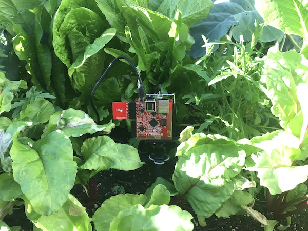

# Tessel2 Code Snippets 

Various adventures hacking with the [Tessel 2](https://tessel.io) IoT Development Platform. This repo has a variety of code snippets packaged as independent projects.  See below for a brief description and instructions on how to run.

### /accelerometer

Reports the x, y, z data using the [accelerometer module](https://github.com/tessel/accel-mma84).  To run this snippet, attach the Accelerometer sensor to Port A of your Tessel.  Then simply do:

````
cd accelerometer
npm install
t2 run index.js
````


### /ambient

Reports the light and sound levels using the [ambient module](https://github.com/tessel/ambient-attx4).  To run this snippet, attach the Ambient sensor to Port A of your Tessel.  Then simply do:

````
cd ambient
npm install
t2 run index.js
````


### /climate

Reports the temperature and humidity using the [climate module](https://github.com/tessel/climate-si7020).  To run this snippet, attach the Climate sensor to Port A of your Tessel.  Then simply do:

````
cd climate
npm install
t2 run index.js
````



### /camera-clap

Turns on the camera after you 'clap your hands' and hosts the camera output over HTTP using the Tessel as a web server.  To run this sample, attach the Ambient sensor to Port A of your Tessel.  Then attach an external [USB camera](https://www.amazon.com/gp/product/B0092QJRPC/ref=oh_aui_detailpage_o03_s00?ie=UTF8&psc=1) to any of the USB ports on the Tessel.  Then simply do:

````
cd camera-clap
npm install
t2 run index.js
````


### /camera-stream

The camera streams to a web page hosted on the Tessel.  To run this sample, attach an external USB camera to the Tessel then do:

````
cd camera-stream
npm install
t2 run index.js
````


### /drone

Loading a Tessel onto a mini-drone as sensor cargo (using tape and legos).


## Command Line Interface (CLI) Snippets 

Below are various __t2-cli__ snippets when working with the Tessel micro-controller.

#### What do I need to do to get my Development Environment set up?

1) Install [Nodejs](https://nodejs.org/en/) 4.2.x or greater.

2) In Terminal, install the Tessel 2 Command Line Interface (CLI) with: 

````
npm install -g t2-cli
````

#### How do I connect to my Tessel via USB?

1) Plug in the Tessel 2 board to your computer via the provided micro-USB cable.

2) In Terminal, test your connection by doing:

````
t2 list
````

In Terminal, confirm that you see a 'USB' connection reporting your Tessel board's identifier. 

#### How do I connect to my Tessel via Wifi (2.4 GHz networks)?

In Terminal, connect to a wifi network with: 

````
t2 wifi -n <EnterNetworkName> -p <EnterPassword>
````

Confirm that when you connect, you see a 'LAN' connection listed with:

````
t2 list
````

#### How do I set up my Tessel so I can push code to it?

In Terminal, set up for pushing code with:

````
t2 provision
````

#### How do I create a new Tessel Project?

Create a new project with basic scaffolding with:

````
mkdir MyProjectFolder
cd mkdir
t2 init
````

#### How do I run my Tessel Project?

In Terminal, run a project with:

````
cd MyProjectFolder
t2 run index.js
````

#### How do I stop running my Tessel Project?

On your keyboard do: [Control] + [C]
